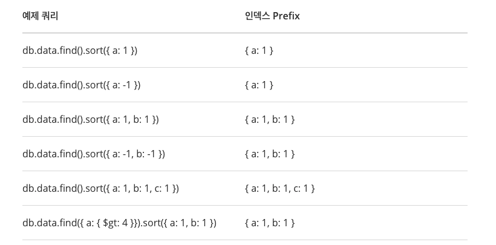
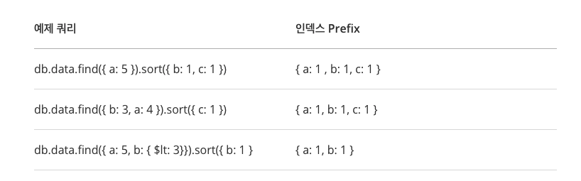
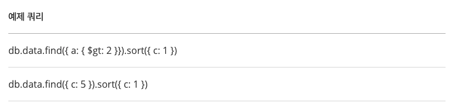

# 몽고DB

기존의 Entity-Relationship 의 데이터 구조에서는 갈수록 복잡해 지는 데이터 구조 시대에 대응이 어렵다. NoSQL 은 관계지향의 개념을 깨고 원하는 데이터 끼리 뭉쳐서 더 큰 데이터를 활용하자는 목적에서 나온 개념이다.

기존의 주문 RDB의 대량의 데이터들을 처리하기 위해, 주문 히스토리성 데이터들을 하나로 뭉쳐서 관리하기 위해 NoSQL 중 하나인 몽고DB를 사용하려고 한다.

## 용어정리

익숙한 RDB와 비교하여 먼저 용어 정리.

| RDB         | MongoDB            |
| ----------- | ------------------ |
| Database    | Database           |
| Table       | Collection         |
| Row / Tuple | Document           |
| Column      | Key / Field        |
| Join        | Embedded Documents |
| Primary Key | Primary Key (_id)  |


## 특징

* Document 는 key-value  형태의 BSON (Binary JSON) 형태로 되어 있다.

* 다양한 인덱싱을 제공한다.

  * Sigle Field Index : 기본적인 단일키 인덱스
  * Compound Index : 복합 인덱스
  * Multikey Index : 배열에서 매칭되는 값이 하나라도 있으면, 인덱스에 추가하는 인덱스
  * Geospatial Index and Query : 위치기반 인덱스
  * Text Index : 문자열 인덱스
  * Hashed Index : B-Tree 가 아닌 Hash 타입의 인덱스

* Replication & Availability : 데이터 복제 & 가용성 향상 (CAP 이론 중 AP 보장)

* Auto-Sharding : 자동으로 데이터를 분산하여 저장하며 하나의 컬렉션처럼 사용할 수 있게 해준다. Scale-Out(수평확장) 가능.

* Documented-based query : 필터링, 수집, 정렬, 정규식 등 다양한 종류의 쿼리 지원

* 맵리듀스 지원

* GridFS : 분산파일 저장을 자동으로 해줌. 실제 파일의 위치는 신경쓸 필요가 없다.

  

## 장단점

### 장점

* Flexibility : Schema-less 로 변화에 유현하다
* Performance : Read/Write 성능 우수
* Scalability : Auto Sharding 으로 수평확장의 용이성.
* Deep Query Ability : SQL 만큼 강력한 쿼리 성능 제공
* Conversion / Mapping : JSON 형태로 직관적이고 개발이 편리.

### 단점

* JOIN 이 없다. -> JOIN 이 필요없게 데이터 구조화를 할 필요가 있다.
* 데이터 일관성. 트랜잭션이 필요한 경우 부적합 하다.
* Memory Mapped File, 파일엔진DB이다. 메모리 관리를 OS에게 위힘한다. 메모리에 의존적이고 메모리의 크기가 성능을 좌우한다.
* B트리 인젝스를 사용하는데 B트리 크기가 커질수록 새로운 데이터를 입력/수정 할때 성능이 저하된다. 그래서 데이터 변경없이 조회만 할 경우에 더 적합하다.


## Physical 데이터 저장 구조

메모리 크키가 성능을 좌우하는 이유를 내부 저장 구조를 살펴보면서 이해 해보자.

### 저장구조

몽고DB는 Memory Mapped File (OS에서 제공되는 MMAP) 을 사용한다. 데이터를 write 할ㄷ 때, 논리적으로 메모리 공간에 write 하고 일정 주기에 따라서, 이 메로리 block들을 주기적으로 disk로 write 하는데, disk 에 write 하는 작업이 OS에 의해서 이루어진다.


Pysical Memory (RAM)의 양이 작더라도 Virtual Memory 는 훨 씬 큰 공간을 가질 수 있다. (HDD 를 OS 레벨에서 메모리 공간으로 활용할 수 있다)

Virtual Memory는 page 라는 블럭 단위로 나누어 지고, 이 block들은 disk의 block들에 mapping이 되고, 이 block들의 집합이 하나의 데이터 파일이 된다.


### 메모리에 저장되는 내용

데이터와 index가 메모리에 저장된다. 몽고DB는 index를 남용하지 말라는 이야기가 있는데, index를 생성 및 업데이트 하는데 자원이 들어가고, index가 메모리에 상주해야 제대로 된 성능을 낼 수 있기 때문이다.

Phsical Memory에 데이터 블록이 없으면, page fault가 발생하게 되고, disk에서 데이터 블록을 loading을 로딩하게 된다. 이 과정에서 memory와 disk 사이에 컨텍스트 스위칭이 발생하고, DISK IO로 인해 성능 저하가 발생한다.

즉, 메모리 용량을 최대한 크게 해서 이 page fault 를 줄이는게 핵심이다. 아예 발생 안하게 할 수는 없고, 줄이는 전략으로 접근을 해야한다. (1TB를 저장하려고, 메모리를 1TB를 올릴 수는 없다.)

page fault 시 disk로 write 되는 데이터는 LRU 알고리즘에 의해서 결정이 된다. 즉, 자주 안쓰는 데이터가 disk로 out 되는데, 일반적인 application에서 자주 쓰는 데이터의 비율은 그리 크지 않다. (전체 데이터중 자주 접근하는 데이터의 비율은 매우 낮다)

자주 엑세스 되는 데이터를 Hot Data 라고 하는데, 이 Hot Data들이 집둥되서 메모리에 올라가도록 Key 설계를 하는 것이 핵심이다. 쓸데 없이 전체 데이터를 scan하는 등의 작업을 하게 되면, 100% page fault가 발생하기 때문에 table scan 등이 필요한 시나리오는 별도의 index table(summary table)을 만들어서 사용하는 등의 전략이 필요하다.


## Index 설계 전략

내가 가진 수많은 데이터를 효과적으로 검색하려면 어떤 키들을 어떤 순서로 정렬해두어야 할지를 고민해야 한다.

1. 촘촘하게 인덱스를 작성해서 selectivity를 높여야 한다. 짝수/홀수 같이 너무 큰 범위의 인덱스는 성능을 저하 시킨다.
2. 쓰기 작업이 많은 데이터셋은 인덱스를 복잡하게 설계하지 않는다. 새로 추가된 데이터가 추가될 인덱스를 찾는 작업이 성능을 저하시킬 수 있다.
3. 메모리를 충분히 확보하고 모니터링 해야한다.


### 테스트

몽고DB에는 여러 종류의 인덱스가 있고 각각 상황에 맞게 사용되어야 한다. 몽고DB가 쿼리를 수행하기 위해 어떤 계획을 세우고, 어떤 인덱스를 사용하고, 얼마나 오랜 시이 걸리는지를 확인할 수 있는 방법을 제공한다. 이런 것들을 활용해 테스를 하고 가장 적합한 인덱스를 찾아내야 한다. 

주로 사용하는 인덱스 검사 메소드는 `hint()` 와 `explain()`이 있다.


### Single Key Index

쿼리에서 단 하나의 키만을 이용한다면, 단일 키 인덱스를 사용해야 한다.

```java
db.order.createIndex({orderNo : 1});
```

orderNo 필드를 키로 인덱스를 생성한다. `1`은 오름차순, `-1`은 내림차순이다.

단일 인덱스는 어느 방향으로 읽던, 동일한 성능을 낸다. -> page fault 를 고려할 수 도 있을 것 같다.

### Compound Index

검색에 여러키가 사용되면 이 타입으로 정의해야 한다.

```java
db.order.createIndex({orderDatetime: 1, orderNo: 1})
```

여러개의 키로 인덱스를 지정하였다고 해서, 각각의 키로 검색할 수 있는 것은 아니다. 두개의 키는 단일 인덱스처럼 일렬로 나열되어 인덱싱이 된다.

```
min -- {1/1, 1} - {1/1, 2} ----- {1/4, 1}, {1/4, 2}, {1/4, 3} ---------- max
```

위와 같이 두개의 키가 하나의 묶음으로 정렬되어 인덱싱 된다. 위와 같이 익덱스가 생성된 상태에서 `orderNo`로 조회 한다면 성능이 좋을 수가 없다. 이 경우 따로 `orderNo`의 단일 인덱스를 생성해 주는 것이 성능을 확보할 수 있다.

컴파운드 인덱스에서 핵심은 인덱스의 순서대로 쿼리문을 사용해야 한다는 것이다.

`orderDatetime` 만 사용하는 경우, `orderDatetime, orderNo`를 사용하는 경우는 옳은 검색 방법이다. 하지만 `orderNo`만 단독으로 검색하는 것은 옳지 않다.

이는 쿼리 결과를 정렬할때에도 동일하게 적용된다.

단일 인덱스건, 컴파운드 인덱스건 결국 일렬로 저장되어 있다는걸 생각하면서, 정렬을 어떻게 하는게 쉬운지를 생각해보면 된다.

### 인덱스 Prefix

```java
db.collection.createIndex({ x: 1, y: 1, z: 1 })

{ x: 1 } // OK
{ x: 1, y: 1 } // OK
{ x: 1, y: 1, z: 1 } // OK
```

정의 된 인덱스의 앞 부분부터 포함하는 붑누집합의 인덱스를 "인덱스 prefix"라고 한다. 이것도 동일하게 일렬로 정렬된 인덱스를 생각하면 이해가 쉽다.  결국 이 인덱스prefix 대로 쿼리의 정렬 조건을 넣어줘야 성능이 나올 수 있다.



인덱스 prefix가 아니더라도, 아래와 같은 경우들은 사용이 가능하다. 역시 일렬로 정렬된 인덱스 구조를 생각하면서 보면 이해할 수 있다.

#### 가능한 case



#### 잘못된 case




### 인덱스 교차

인덱스를 별개로 지정하더라도 쿼리가 구동 될 때에 내부에서 교집합처럼 동작하여 성능을 높이는 것.

```json
{ qty: 1 }
{ item: 1 }
```

위와 같이 별도의 단일 인덱스 두개는

```java
db.orders.find({item: 'abc', qty: {$gt: 15}})
```

위와 같은 쿼리에서 인덱스 교차가 저용되어, 인덱스가 활용된다. 다만 명시적으로 선언해서 적용되는게 아니어서, 반드시 `explain()`을 사용해서 확인을 해야 한다. 인덱스 교차가 동작하면 `AND_SORTED`, `AND_HASH` 가 발견 된다.


### 컴파운드 인덱스 vs 인덱스 교차

각각의 방식은 조건과 한계가 존재.

* 컴파운드 인덱스 : 정렬시 키의 순서와 각 키의 정렬 방향이 중요. 인덱스 prefix 규칙 적용.
* 인덱스 교차 : 쿼리의 검색 조건에 사용한 인덱스와 별개로 선언된 인덱스를 정렬 조건으로 사용할 수 없다. 보통 컴파운드 인덱스보다 성능이 느리다.


## 모델링

### References

* 문서간 레퍼런스 형태로 데이터 접근이 가능

### Embedded Data

- Single document에 sub document 를 포함하는 구조
- Document(BSON)는 16MB를 넘을 수 없음.

인덱스는 생성시 쓰기 동작 성능을 저하시킨다.


## 참고

* https://bcho.tistory.com/746
* https://blog.ull.im/engineering/2019/04/05/mongodb-indexing-strategy.html


