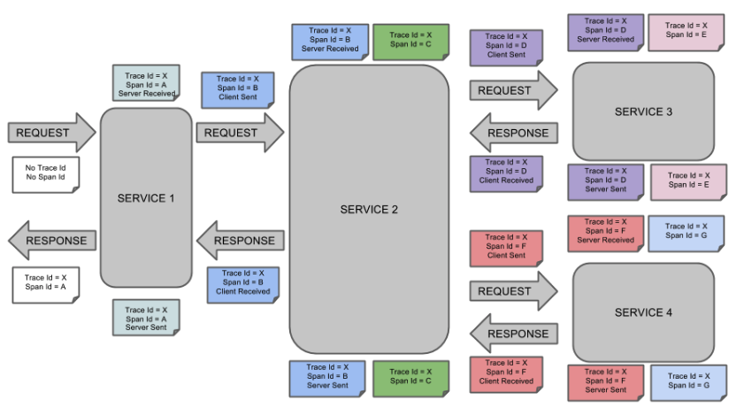
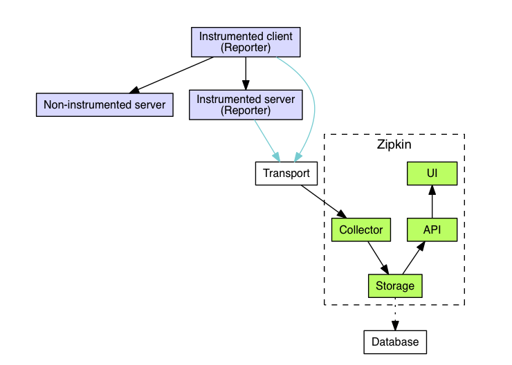
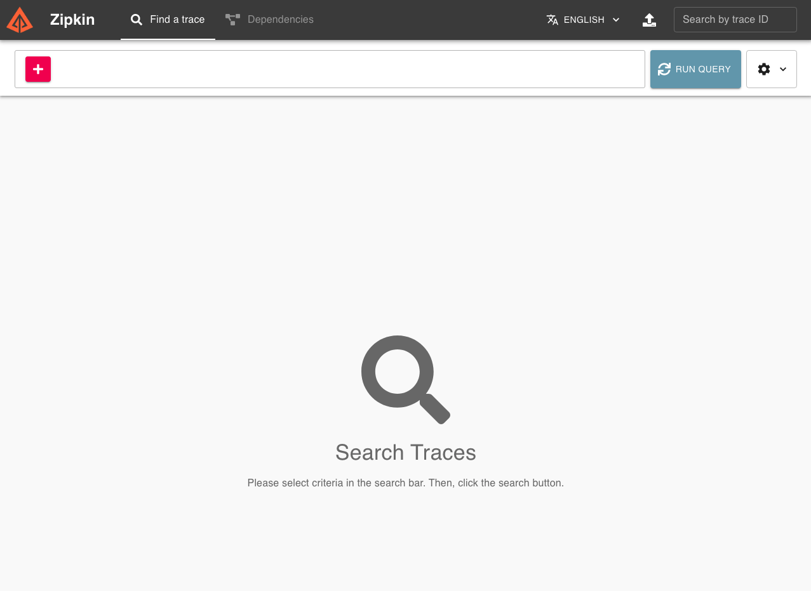

# Spring Cloud Sleuth

MSA 환경에서 여러 시스템에 걸쳐 처리되는 하나의 트랜잭션을 추적하기 위해서, 분산 로그 추적 시스템 이라는 것이 필요하다.

이런 분산 로그 추적을 위해서는 Trace와 Span 이라는 개념을 사용한다.

클라이언트의 호출 하나를 Trace라고 하고, 서비스 컴포넌트간의 호출을 Span 이라고 한다.




이러한 부산 로그 추적 솔루션에는 트위터에서 개발된 ZipKin, Jagger, Opencensus 등이 있는데, 이러한 솔루션은 구글의 Dapper 논문을 기초로 개발되었다.


## Zipkin



Zipkin 은 Zipkin Client Library 를 통해서 Zipkin Server 로 Trace, Span 정보를 전달하면 서버에 전달하면 해당 정보를 볼 수 있다. HTTP, gRPC 에 대한 트레이스가 가능하다.

- Client Library : 우리가 사용할 라이브러리이다. 트레이스 정보를 Zipkin Server의 Collector 로 보낸다. Collector로는 HTTP, Kafka, Scribe 를 통해 전송할 수 있다.
- Collector : 트레이스 정보를 유효성 검사, 저장, 인덱싱 한다.
- Storage : Cassandra, ElasticSearch, MySql 에 저장 가능하다.
- API : Zipkin 서버에서 제공되는 쿼리 서비스 JSON API 는 데이터가 저장되고 인덱싱 되면, 해당 정보를 추출할 수 있게 해준다. Zipkin 서버의 Web UI 도 이를 활용한다.
- UI : 트레이스를 볼수 있는 대시보드 페이지이다. 저장공간으로 ElasticSearch 를 사용 하면 키바나를 활용할 수도 있다.

### Quick Start

https://zipkin.io/pages/quickstart.html 링크에 여러가지 방법을 제공하는데, 나는 Docker 를 사용했다.

```sh
docker run -d -p 9411:9411 openzipkin/zipkin
```

위 명령어 한 줄 이면 Zipkin 을 실행할 수 있다.



Docker를 통해 Zipkin을 실행하면, http://localhost:9411 에 접속하면 대시보드 확인이 가능하다.


## Spring Cloud Sleuth

Spring Cloud Sleuth 는 Zipkin Client Library 중 하나로써, Spring Boot auto-configuration 을 제공한다.

### Quick Start

```groovy
plugins {
    id 'org.springframework.boot' version '2.4.1'
    id 'io.spring.dependency-management' version '1.0.10.RELEASE'
    id 'java'
}

group = 'com.example'
version = '0.0.1-SNAPSHOT'
sourceCompatibility = '1.8'

repositories {
    mavenCentral()
    maven { url 'https://repo.spring.io/milestone' }
}

ext {
    set('springCloudVersion', "2020.0.0")
}

dependencies {
    implementation 'org.springframework.boot:spring-boot-starter-web'
    implementation 'org.springframework.cloud:spring-cloud-starter-sleuth'
    testImplementation 'org.springframework.boot:spring-boot-starter-test'
}

dependencyManagement {
    imports {
        mavenBom "org.springframework.cloud:spring-cloud-dependencies:${springCloudVersion}"
    }
}

test {
    useJUnitPlatform()
}
```

```java
@RestController
public class DemoController {
    private static Logger log = LoggerFactory.getLogger(DemoController.class);

    @RequestMapping("/")
    public String home() {
        log.info("Receive Request.");
        return "Hello World";
    }
}
```

추가로 application.yml 에 application 이름을 추가해 보자.

```yaml
spring.application.name: sleuth-tester
```

위와 같이 어플리케이션을 생성 후 http://localhost:8080/ 을 호출해 보면 아래와 같은 정보를 확인할 수 있다.

```
INFO [sleuth-tester,620c7c924e1d4c8e,620c7c924e1d4c8e] 27387 --- [nio-8080-exec-1] com.example.sleuth.DemoController        : Receive Request.
```

로그레벨 뒤에 [어플리케이션이름, traceId, spanId] 가 추가 되었다. 

각각의 아이디는 MDC에 traceId, spanId 라는 키값으로 저장된다.

RestTemplate 등을 이용해 외부 서비스를 호출 하면 트레이스 정보는 해더에 포함되어 전송이 되며, 외부 서비스에 Sleuth 가 추가되어 있다면 트레이스가 연결되는 것을 확인할 수 있다.