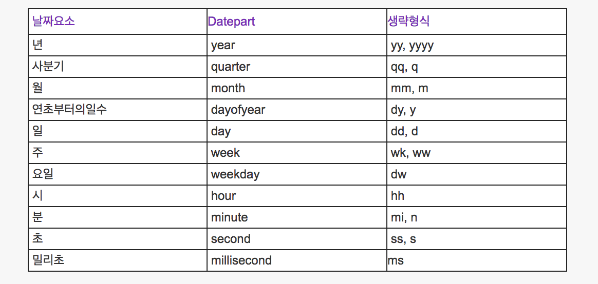
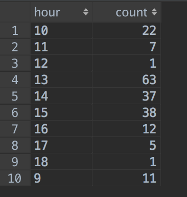

# MS-SQL 에서 시간별로 데이터 뽑기
DB의 데이터를 1시간간격이건 10간격이건, 특정 시간 간격으로 뽑고싶은 경우가 있다. 이때 datename 을 활용할 수 있다.

## datename
### 사용법
```sql
datename(데이터형식, 날짜)
```
### 데이터형식

출처: http://irisgnu.tistory.com/17 [이리의 공간]

### 예제
오늘의 요일 가지고오기
```sql
select datename(dw, getdate())
```

## 일정 시간 간격으로 데이터 뽑기
이제 datename 을 활용해서 1시간 간격으로 발생한 주문수를 뽑아보자
```sql
SELECT
  datename(hh, order_datetime) AS hour,
  count(*)             AS count
FROM order
WHERE order_datetime = '2018-05-03'
GROUP BY datename(hh, order_datetime)
```

위와같은 쿼리로 아래같은 결과를 뽑을 수 있다.

