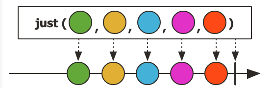
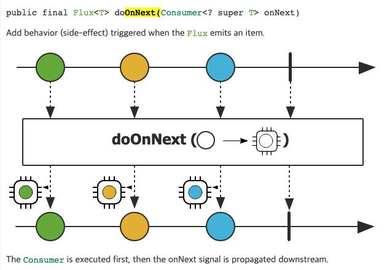

# WebFlux

## Flux와 Mono

둘다 reactive stream의 publisher 이다. Flux는 0개 이상의 데이터를, Mono는 0개 또는 1개의 데이터를 발생시킬 수 있다.

Publisher는 next, complete, error 신호를 발생할 수 있다. 

```java
Flux.just(1, 2, 3);
```

위 코드는 1, 2, 3의 next 신호를 발생시키고 complete 신호를 발생하여 스트림을 종료한다.



just를 표현하는 그림을 보면, ----> 는 시간축, O는 데이터를, | 는 ceomplete 를 의미한다.

보통 Flux, Mono 를 직접 생성하기 보다는 다른 라이브러리가 제공하는 걸 사용할 때가 많다. 예를 들면 WebClient 가 있다.

## 구독과 신호 발생

스트림은 바로 신호를 발생하는게 아니라, 구독을 해야 시작한다.

```java
Flux.just(1, 2, 3, 4, 5)
  .doOnNext(it -> log.info("doOnNext() - {}", it))
  .subscribe(it -> log.info("subscribe() - {}", it));
```

doOnNext는 Flux가 next 신호를 발생할 때 호출된다.




subscribe를 하지 않으면 next 신호가 발생하지 않아 아무런 동작을 하지 않는 것을 확인할 수 있다.


